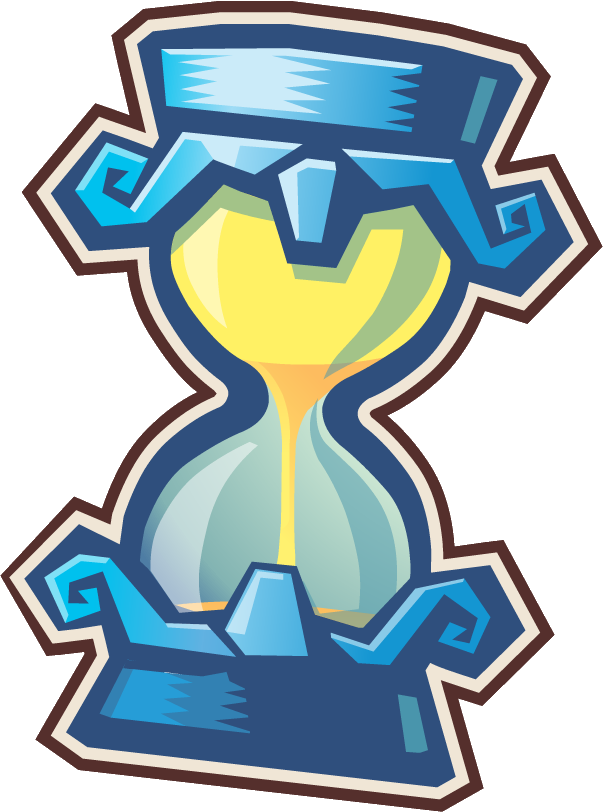

# L'énigme du sablier

- Ce projet se propose de résoudre l'énigme du sablier en utilisant le langage **TLA+**

- Il se décompose en plusieurs niveaux, avec un sablier de plus pour chaque niveau

`Niveau 1 : mesurer 9 minutes avec un sablier de taille 3 minutes`

`Niveau 2 : mesurer 9 minutes avec 2 sabliers de tailles respectives 7 et 4 minutes`

`Niveau 3 : pas encore décidé (TLA+ décidera lol)`

