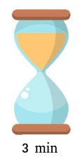
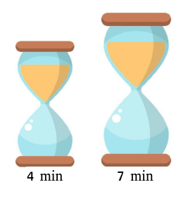
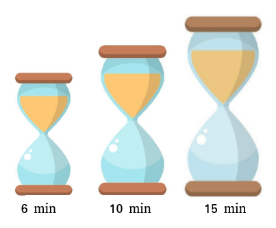

# L'énigme du sablier

### Ce projet se propose de résoudre l'énigme du sablier en utilisant le langage **TLA+**

### Il se décompose en plusieurs niveaux, avec un sablier supplémentaire à chaque niveau.

## 											Niveau 1 

- Le premier niveau propose de **mesurer 9 minutes** avec un sablier de taille 3 minutes. Il s'agit d'un niveau très simple pour découvrir les actions possibles d'un sablier :
  - retourner
  - écouler

## 												Niveau 2

- Le deuxième niveau est plus complexe, il propose de **mesurer 9 minutes** avec 2 sabliers de tailles respectives 7 et 4 minutes. Une certaines réflexion est nécessaire pour le résoudre.

## 												Niveau 3 : 

- Le troisième et dernier niveau nécessite de manipuler 3 sabliers, plus gros que les précédents : 15, 10 et 6 minutes respectivement. Il s'agit ici de **mesurer 17 minutes**.

